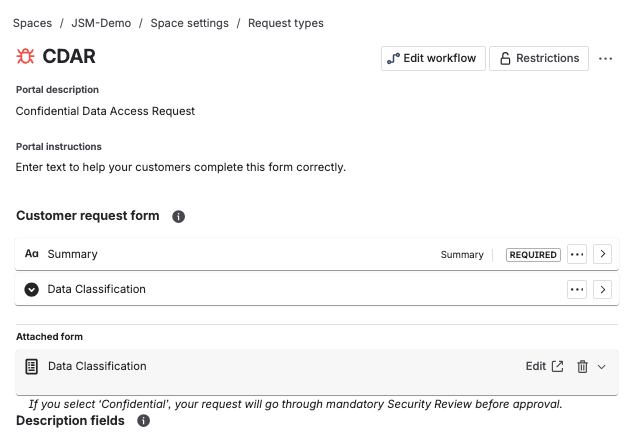

# 🧩 Jira Service Management Demo – Confidential Request Workflow

This project showcases how I designed and implemented a **Jira Service Management (JSM)** system to simulate a **Confidential Data Access Request (CDAR)** process, focusing on **workflow automation, SLA tracking, and compliance visibility**.

---

## 🚀 Project Overview

| Category          | Description                                                  |
| ----------------- | ------------------------------------------------------------ |
| **Environment**   | Jira Service Management Cloud (Team-managed / Space model)   |
| **Goal**          | Simulate a realistic workflow for confidential data access and internal security review |
| **Owner**         | Tianmin Zhang                                                |
| **Core Features** | Custom request types, automation rules, SLA tracking, workflow visualization, and dashboard reporting |

---

## 🧱 System Architecture

The JSM Demo consists of several integrated modules that collectively replicate a professional ITSM process.

- **Request Type:** *Confidential Data Access Request (CDAR)*  
- **Workflow:** *To Do → In Progress → Security Review → Done*  
- **SLA:** *8h response time for confidential issues*  
- **Automation:** Auto-assignment, notification, and SLA alert rules  
- **Dashboard:** SLA success rate and Time to Resolution metrics  
- **AI Exploration:** Verified AI Agent (Atlassian Intelligence) configuration flow  

📘 Reference: [`docs/architecture.md`](./docs/architecture.md)

---

## 🔄 Workflow Design

This workflow ensures that confidential requests follow a secure review process before closure.

**Workflow States:**
1. **To Do** — New ticket created  
2. **In Progress** — Assigned to analyst  
3. **Security Review** — Sensitive data verified  
4. **Done** — Approved and archived

📘 Details: [`docs/workflow-design.md`](./docs/workflow-design.md)

---

## ⚙️ Automation Rules

Automation was configured to reduce manual overhead and enforce SLA adherence.

**Key Rules:**
1. Auto-assign “Confidential” tickets to the Security queue.  
2. Notify requester when status = *Security Review*.  
3. Send Slack alert when SLA target is near breach.  

📘 Details: [`docs/automation.md`](./docs/automation.md)

---

## ⏱️ SLA Settings – Confidential Response Time

The SLA ensures that sensitive requests are handled promptly with clear accountability.

| Parameter      | Configuration                |
| -------------- | ---------------------------- |
| Start counting | Issue Created                |
| Stop counting  | Comment for Customers / Done |
| Calendar       | 24/7                         |
| Target         | 8 hours                      |

📘 Additional SLAs and reports documented in [`docs/automation.md`](./docs/automation.md)

---

## 🧾 Request Type – CDAR (Confidential Data Access Request)

Custom request form designed for security and compliance validation.

| Field                           | Purpose                                      |
| ------------------------------- | -------------------------------------------- |
| **Requester Name / Department** | Identify responsible entity                  |
| **Data Classification**         | Dropdown: Public / Confidential / Restricted |
| **Business Justification**      | Describe access reason                       |
| **Security Review Notes**       | Used during review stage                     |

📘 Configuration details in [`docs/architecture.md`](./docs/architecture.md)

---

## 📊 Reporting & Dashboards

Visual dashboards were built to track SLA success rate and request resolution time.

**Included metrics:**
- SLA success rate (%)
- Created vs Done trend
- Time to Done average

📘 Reports overview: [`docs/lessons-learned.md`](./docs/lessons-learned.md)

---

## 🧩 Configuration Evidence

All project configuration was implemented manually in a live Jira Cloud environment.  
Since Team-managed projects don’t support JSON export, evidence is documented through screenshots and structured markdown files.

📁 See [`export/configuration-evidence.md`](./export/configuration-evidence.md)

---

## 🧠 Lessons Learned

Key insights from building this demo:

- Automating triage and SLA tracking dramatically improves response time.  
- Visual dashboards make SLA performance transparent and actionable.  
- Integrating workflow logic with security steps ensures compliance readiness.  
- Exploring AI Agent integration builds future-proof automation thinking.  

📘 Reference: [`docs/lessons-learned.md`](./docs/lessons-learned.md)

---

## 🧰 Tech Stack

- **Platform:** Jira Service Management (Cloud Free / Team-managed)  
- **Tools:** Automation Rules, SLA, Dashboard Reports, Request Type Config  
- **Documentation:** Markdown + Screenshot Evidence  
- **Version Control:** GitHub Repository (Public Demo)

---

## 👩‍💻 Author

**Tianmin Zhang**  
Amazon Ireland | KYC → Technical Transition | AWS Certified  
📍 Dublin, Ireland  
[LinkedIn](https://www.linkedin.com/in/your-profile) | [Email](mailto:your@email.com)

---

*Last updated: Oct 2025*  