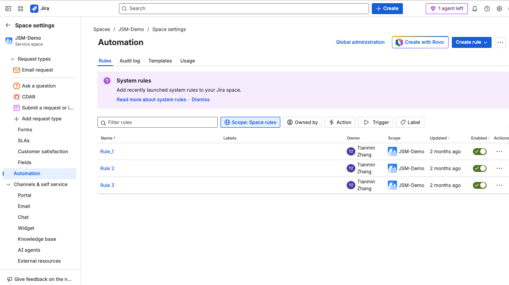

# Automation Rules

Three automation rules are configured to enhance ticket management and reduce manual overhead.

## Rule 1 — Auto-Assign Security Requests
**Trigger:** Issue created with label `Confidential`  
**Action:** Assign to Security Team Queue  
**Outcome:** Ensures critical requests are prioritized.

## Rule 2 — Notify Requester on Security Review
**Trigger:** Status changes to `Security Review`  
**Action:** Send email notification to requester  
**Outcome:** Improves transparency and reduces update delays.

## Rule 3 — SLA Breach Alert
**Trigger:** SLA target about to breach  
**Action:** Send Slack alert to `#security-ops` channel  
**Outcome:** Prevents SLA violations and improves accountability.

