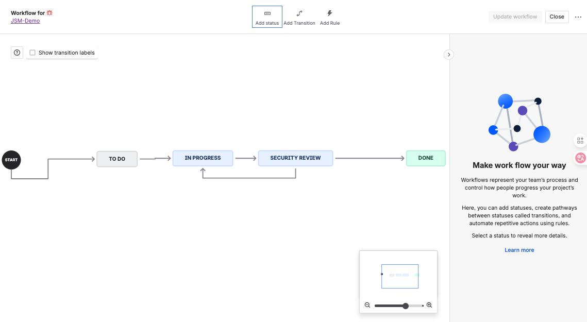
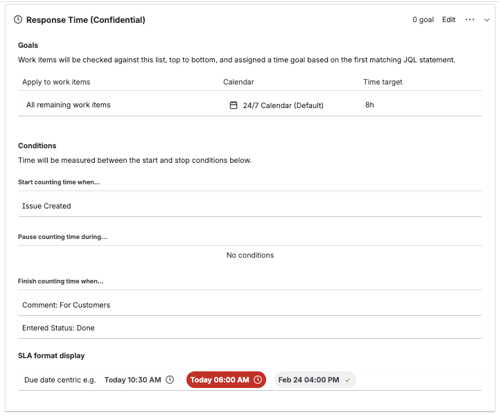
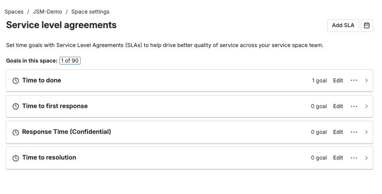

# Configuration Evidence

This document replaces the project-config.json export, as Team-managed (JSM Space) projects in Jira Cloud do not currently support configuration export.

## Summary
All configurations and workflows shown below were manually implemented by **Tianmin Zhang** in the JSM Demo project.

| Category         | Description                                              | Evidence                                                 |
| ---------------- | -------------------------------------------------------- | -------------------------------------------------------- |
| Workflow         | To Do → In Progress → Security Review → Done             |               |
| Automation Rules | 3 rules for auto-assignment, notification, and SLA alert |       |
| SLA Settings     | Confidential tickets 8h response                         |  |
| Reports          | SLA success rate, Created vs Done, Time to Done          |             |
| Request Types    | CDAR (Confidential Data Access Request)                  |               |

## Admin Settings
Project Type: *Service Management (Team-managed, Space model)*  
Created by: *Tianmin Zhang*  
Last Updated: *1 months ago*  
Scope: *JSM-Demo Space, tracymm.atlassian.net*

## Verification Note
The environment is a live Jira Cloud Service Management space, where all configuration screenshots and automation rules are taken directly from the active system.