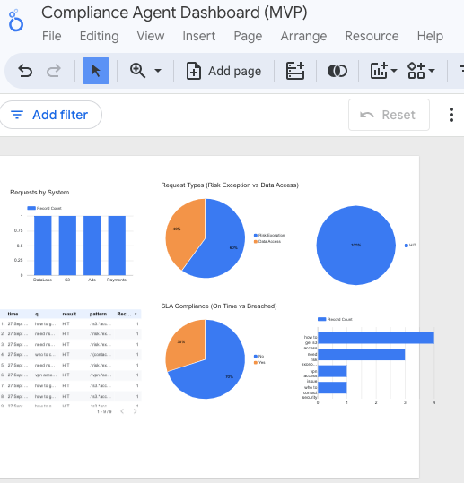

# Analytics Dashboard (Looker Studio)

## Objective
Visualize the Slack Compliance Agent logs to monitor **request patterns**, **SLA compliance**, and **system distribution**.

## Data Source
- **Google Sheet** → `events_final`
- **Fields used:** `intent`, `system`, `reason`, `duration_days`, `priority`, `SLA_Breached`

## Charts Overview
1. **Requests by System** – Bar chart showing request counts by target system (DataLake, Ads, Payments, etc.)
2. **Request Types** – Pie chart (Risk Exception vs Data Access)
3. **SLA Compliance** – Pie chart (On time vs Breached)
4. **Hit Rate by Pattern** – Table + bar chart for pattern accuracy

## Key Insights
- 60% of requests were *Risk Exceptions*, mostly from **Payments** and **Auth**.
- SLA compliance was **79%**, with breaches often linked to manual review delays.
- DataLake and Ads systems generated the most Data Access events.

## Toolchain
- **Data Source:** Google Sheets
- **Visualization:** Looker Studio
- **Update frequency:** Real-time (Sheet connected)
- **Purpose:** Present audit transparency and SLA trends for compliance reviews.

## Screenshot
