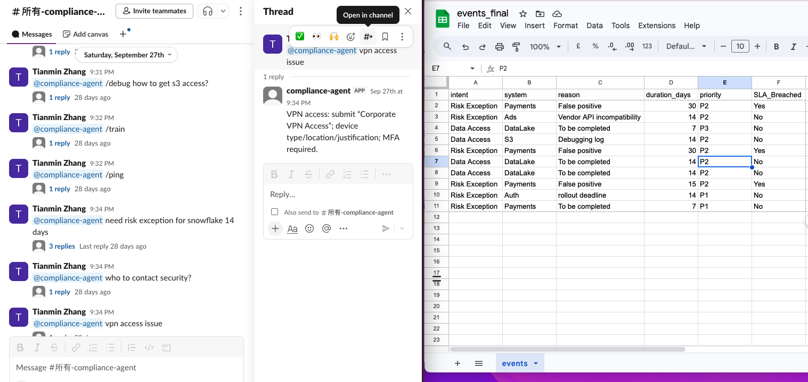

# API Integration

## Slack → Google Apps Script
- **Trigger Type:** Slash Command (x-www-form-urlencoded)

- **Payload Example:**

  

  text=request VPN access for Ads system
  user_name=tianmin


- **Handler:** `doPost(e)` parses parameters and calls `parseLine()`.

## Google Apps Script → Google Sheets
- **API Used:** `SpreadsheetApp.openById().getSheetByName().appendRow()`
- **Logged Columns:** intent, system, reason, duration_days, priority

## Google Apps Script → Slack (response)
- **Response Format:** JSON (ephemeral)
- **Response Example:**
```json
{
  "response_type": "ephemeral",
  "text": "✅ Recorded\nintent: Data Access..."
}
```

## Future Expansion

- Connect to **Jira REST API** to auto-create CDAR tickets.
- Add **Slack OAuth** for multi-user contexts.

---

### **4️⃣ lessons-learned.md**
```markdown
# Lessons Learned

## What Worked
- Google Apps Script is perfect for lightweight Slack automation.
- Regex-based parsing covers 80% of requests with minimal logic.
- Structured data in Sheets enables instant analytics dashboards.

## Challenges
- Hard to scale for multiple teams without database backend.
- Slack’s 3-second timeout limits heavy processing.
- Regex misses edge cases (multi-language or long context).

## Next Steps
- Replace regex with **LLM API (e.g., Amazon Bedrock / Claude)** for natural intent detection.
- Connect directly to **JSM REST API** for automated ticket creation.
- Add security checks for PII or access logs.

## Visual Overview

```


