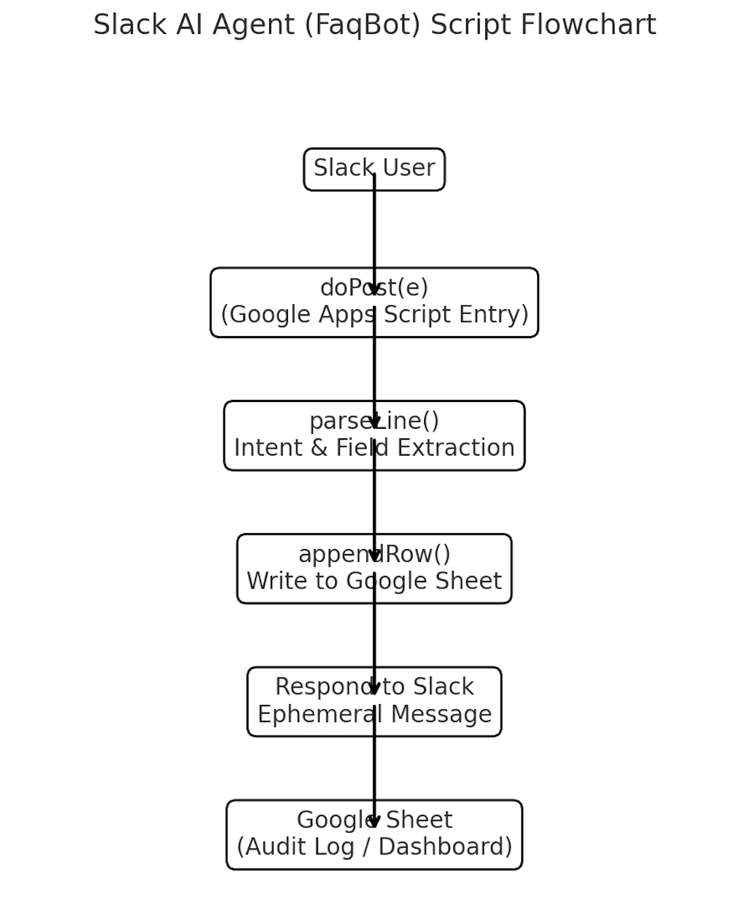

# Workflow

## Overview
The agent receives Slack messages via Slash Command and processes them through five main stages.

1. **Trigger**
   - User types `/faqbot request VPN access for Ads system`.
2. **Input Parsing**
   - The text is analyzed by regex rules in `parseLine()`.
3. **Classification**
   - Intent → Data Access / Risk Exception.
4. **Storage**
   - Append a row in the Google Sheet (`intent, system, reason, duration, priority`).
5. **Response**
   - Reply to Slack within 3 seconds via ephemeral message.

## Visual Flow

